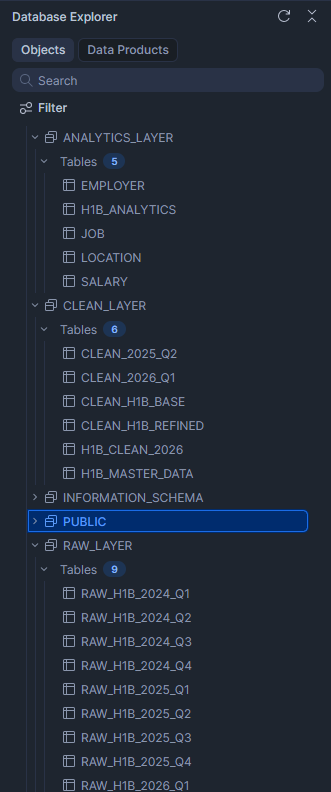

# H1B Data Pipeline using Snowflake

🚀 End-to-end data pipeline built using Snowflake to process and analyze H1B visa data across multiple datasets.

---

## 🔹 Key Highlights

- Built a layered data pipeline (RAW → CLEAN → ANALYTICS)
- Processed multiple datasets (2025 Q2, 2026 Q1)
- Handled schema inconsistencies across datasets
- Designed analytics-ready tables for business insights
- Enabled reporting on hiring trends, salary patterns, and geographic distribution

## 🏗️ Architecture

## 📊 Business Value

This pipeline enables:

- Identification of top H1B hiring companies
- Analysis of salary vs prevailing wage gaps
- Understanding job demand trends
- Geographic analysis of H1B distribution

## ⚡ Data Engineering Concepts Used

- Data Cleaning & Standardization
- Schema Alignment Across Datasets
- Layered Data Architecture
- Aggregation & Business Metrics Modeling